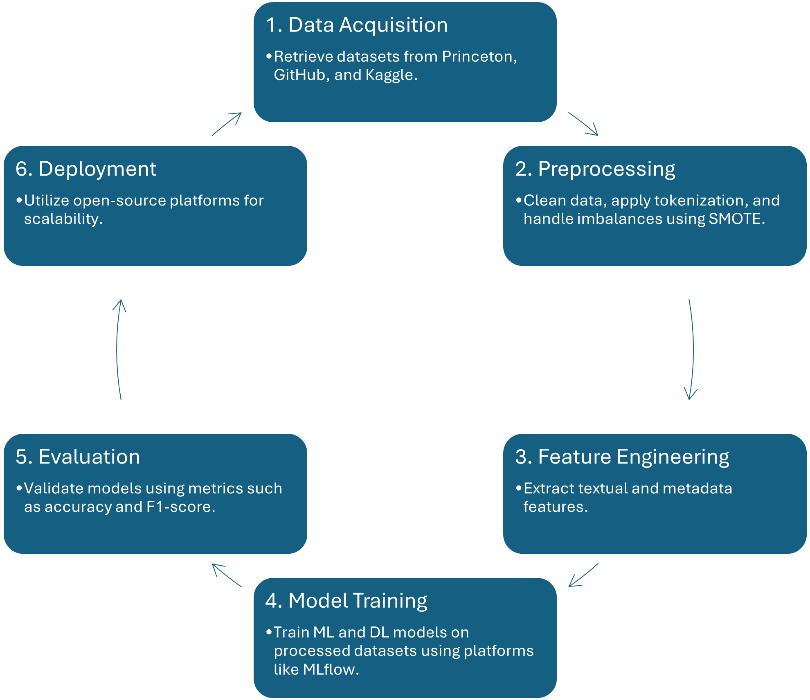

# COVID-19-Fake-News-Detection
This study employed the positivist philosophy which is characterized by focusing on observable, measurable events, and aligns with quantitative measures to validate hypotheses and models. The study utilized datasets that are publicly available. Data preprocessing includes the splitting of the words in the articles into tokens, stemming of these tokens, and class balancing by SMOTE. SVM, Random Forests, CNN and LSTM algorithms were trained and tested based on accuracy, precision, recall and F1 score metrics benchmarked at 85\% based on standards observed in other recent studies.

The results showed that CNN had the highest accuracy of 87.9\% and LSTM with the accuracy of 86.3\% proved its ability to capture the underlying text features. Important models such as the SVM also gave high results with an accuracy of 86.32\%. Consequently, the imbalance of the classes was also resolved and there was a substantial enhancement of the models’ performances by the integration of SMOTE. The study efficiently created a hybrid dataset for the detection of COVID-19 fake news on social media. The findings show that ML/DL models can accurately predict fake news and are useful for preventing the spread of fake news during the health crisis, along with suggestions for real time use in social media systems to flag potentially fake news.
## Methodology

## Data Preprocessing

